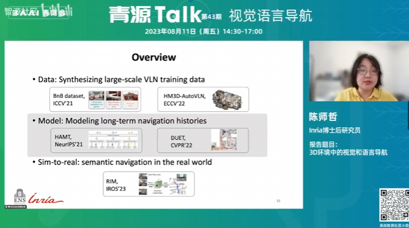

# 大论文：VLN（视觉语言导航）

1.数据   2.模型   3.Sim-to-real

# 扩展就业：JAVA后端前端

尚硅谷Java全套视频教程
B站直达免费在线看：https://space.bilibili.com/302417610/channel/seriesdetail?sid=457613

免费视频及资料下载地址：https://pan.baidu.com/s/1PhTeMkX5vOg0ZRcw0abjCw?pwd=yyds 提取码：yyds 

学习路线及下载导航：http://www.atguigu.com/download.shtml

围观尚硅谷Java课程：http://www.atguigu.com/java

# 相关就业方向：嵌入式

